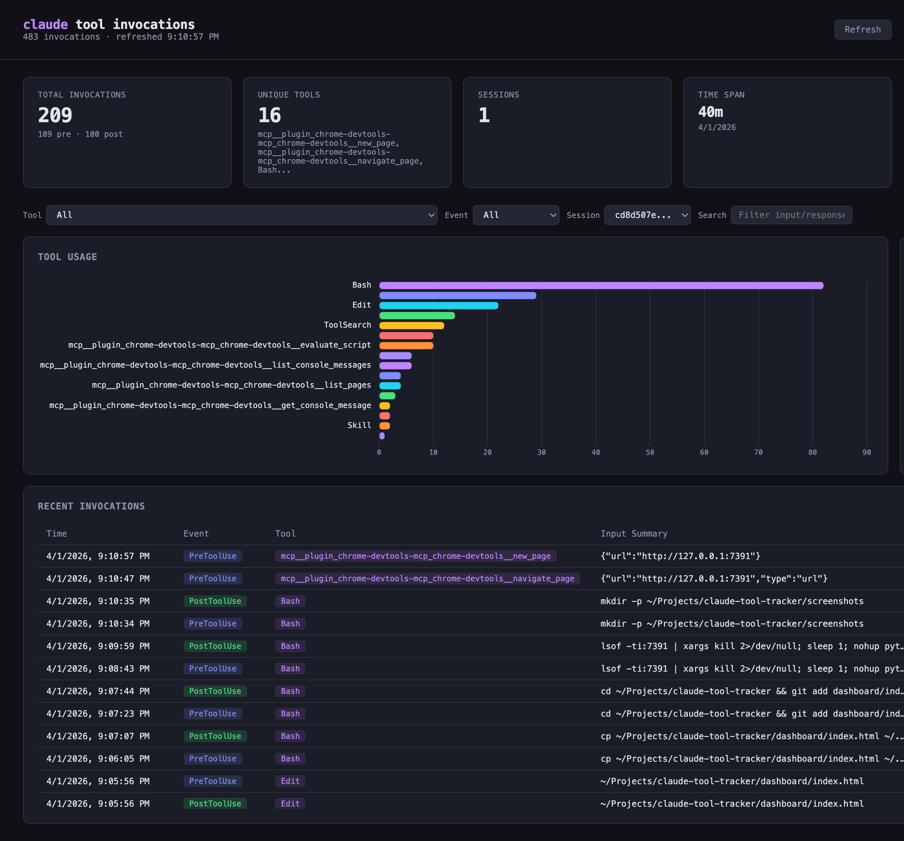
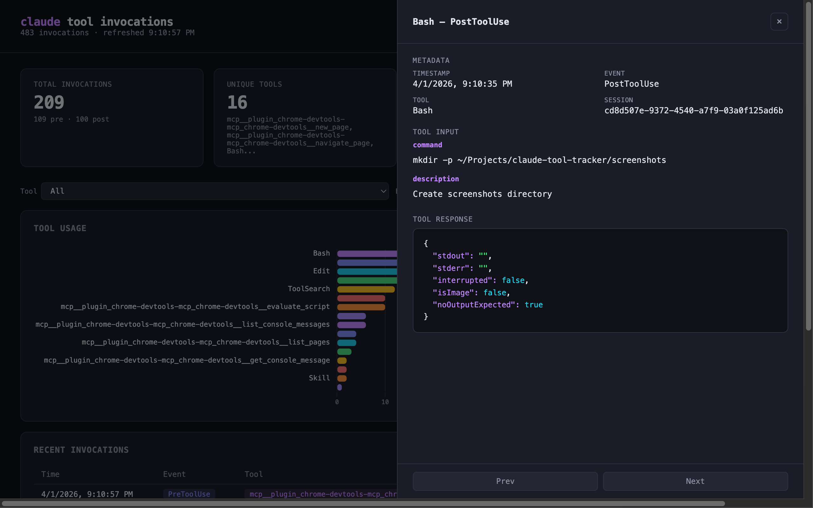

# claude-tool-tracker

Log and visualize every tool invocation in [Claude Code](https://docs.anthropic.com/en/docs/claude-code).

Uses Claude Code [hooks](https://docs.anthropic.com/en/docs/claude-code/hooks) to capture `PreToolUse` and `PostToolUse` events into a local JSONL file, and includes a dashboard to explore them.

  



## What it does

- **PreToolUse hook** — logs timestamp, session ID, tool name, and tool input *before* every tool runs
- **PostToolUse hook** — logs the same plus the tool response *after* every tool completes
- **Dashboard** — a local web UI with charts, filters, and a table of all invocations

All data stays on your machine at `~/.claude/tool-invocations.jsonl`.

## Quick start

```bash
git clone https://github.com/gokhanamal/claude-tool-tracker.git
cd claude-tool-tracker
./setup.sh
```

That's it. The setup script will:

1. Check that `jq` and `python3` are installed
2. Merge the logging hooks into your `~/.claude/settings.json` (preserving existing settings)
3. Install the dashboard to `~/.claude/dashboard/`

## View the dashboard

```bash
python3 ~/.claude/dashboard/serve.py
```

Opens at [http://127.0.0.1:7391](http://127.0.0.1:7391). Use the Refresh button to reload data.

### Dashboard features

- **Stats** — total invocations, unique tools, session count, time span
- **Tool usage** — horizontal bar chart ranking tools by frequency
- **Sessions** — clickable session list that filters the whole dashboard
- **Invocation table** — filterable, searchable, shows input summaries
- **Detail panel** — click any row to see full tool input and syntax-highlighted response



## Query the log directly

The log file is [JSONL](https://jsonlines.org/) — one JSON object per line. Use `jq` to query it:

```bash
# Tool usage frequency
jq -s 'group_by(.tool_name) | map({tool: .[0].tool_name, count: length}) | sort_by(-.count)' ~/.claude/tool-invocations.jsonl

# All Bash commands
jq 'select(.tool_name == "Bash") | .tool_input.command' ~/.claude/tool-invocations.jsonl

# Live stream
tail -f ~/.claude/tool-invocations.jsonl | jq .
```

## Uninstall

1. Remove the `PreToolUse` and `PostToolUse` entries from `~/.claude/settings.json`
2. `rm -rf ~/.claude/dashboard`
3. `rm ~/.claude/tool-invocations.jsonl` (optional — keeps your data)

## Prerequisites

- [Claude Code](https://docs.anthropic.com/en/docs/claude-code)
- `jq` — `brew install jq` (macOS) or `apt install jq` (Linux)
- `python3` (included on macOS and most Linux distros)

## License

MIT
